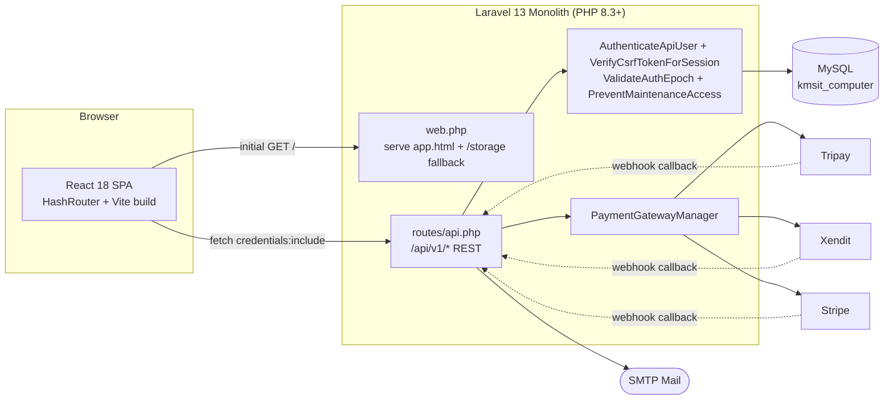
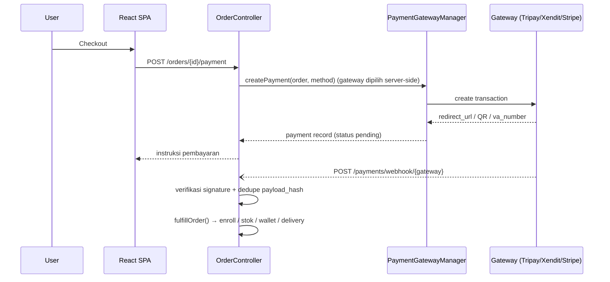

# KMSIT Computer — System Blueprint

**Cetak biru arsitektur teknis platform KMSIT Computer**
Disusun: 08 September 2026 · Diperbarui: 24 September 2026 · Peran: IT Analyst · Architect · Project Manager
Repo: `c:\ServBay\www\kms` · Model deploy: Monolith Laravel (backend) + React SPA (frontend), satu proses

---

## Daftar Isi

0. [Ringkasan Eksekutif](#0-ringkasan-eksekutif)
1. [Arsitektur Sistem](#1-arsitektur-sistem)
2. [Tumpukan Teknologi](#2-tumpukan-teknologi)
3. [Model & Skema Data](#3-model--skema-data)
4. [Peta API Backend](#4-peta-api-backend)
5. [Arsitektur Frontend](#5-arsitektur-frontend)
6. [Modul Fungsional](#6-modul-fungsional)
7. [Keamanan & Model Akses](#7-keamanan--model-akses)
8. [Payment & Integrasi](#8-payment--integrasi)
9. [Deployment & Operasional](#9-deployment--operasional)
10. [Risiko & Utang Teknis](#10-risiko--utang-teknis)
11. [Roadmap Rekomendasi](#11-roadmap-rekomendasi)

---

## 0. Ringkasan Eksekutif

**KMSIT Computer** adalah platform tiga-dalam-satu: **Learning Management System** (kelas, kurikulum, kuis, sertifikat ber-QR), **e-commerce** (produk fisik & digital, keranjang, voucher, tiga payment gateway), dan **CMS** (artikel, berita, tutorial, aktivitas, halaman statis, homepage builder, menu). Seluruh sistem berjalan sebagai **satu aplikasi Laravel 13** yang menyajikan API REST sekaligus meng-host build production dari SPA React — bukan dua layanan terpisah.

**Statistik sistem:**

| Metrik | Jumlah |
|---|---|
| Tabel domain | 41 |
| Controller API | 30 |
| Route SPA | ~46 |
| Payment gateway | 3 (Tripay, Xendit, Stripe) |
| Test backend (PHPUnit) | 214 (42 file) |
| Migration custom | 27 |

Karakter arsitektur yang paling menentukan: **ID non-auto-increment 12 karakter** di hampir semua tabel utama (bukan bigint biasa), **autentikasi berbasis session-cookie** (token bearer Sanctum tersedia sebagai fallback), **RBAC berbasis kolom `permissions` JSON per-role** yang ditegakkan di server lewat helper `AdminAccess`/`InstructorAccess` + `UserPolicy`, dan **installer wizard bawaan** (`/install`) yang menulis `.env` dan menjalankan migrasi tanpa akses SSH — dirancang agar bisa naik ke shared hosting oleh non-developer.

> ✓ Selama audit ini, lima bug produksi nyata ditemukan & diperbaiki langsung di kode: validasi partial-update yang menghapus data (avatar hilang saat simpan profil, produk gagal publish), allowlist `settings/public` yang tidak lengkap (footer tidak menarik data dashboard), serta mismatch kolom pada CMS content (500 error saat membuat berita/tutorial). Semua tercakup regression test baru.

---

## 1. Arsitektur Sistem

Model deploy monolitik: satu proses PHP-FPM melayani API dan SPA shell dari direktori publik yang sama.

Tidak ada proxy dev terpisah untuk `/api` di `vite.config.js` — di produksi, build frontend disatukan ke `backend/public` lewat `postbuild` hook (lihat §9).

**Alur permintaan halaman:**

1. `GET /` dan seluruh path non-API ditangkap catch-all di `web.php` → menyajikan `public/app.html` (shell SPA hasil build Vite).
2. React Router (`HashRouter`) mengambil alih routing di sisi klien menggunakan fragment `#/...`.
3. `AppProvider` memanggil `GET /api/v1/auth/me`, `GET /api/v1/settings/public`, dan `GET /api/v1/categories` saat mount untuk hidrasi state global.
4. Setiap permintaan API terautentikasi melalui cookie session Laravel (bukan header `Authorization`), diperkuat token CSRF dari endpoint Sanctum `/sanctum/csrf-cookie`.

---

## 2. Tumpukan Teknologi

| Kategori | Detail |
|---|---|
| **Backend** | Laravel 13 · PHP 8.3+ · MySQL · Sanctum 4 (session-cookie utama, bearer fallback) · PHPUnit · Laravel Pint |
| **Frontend** | React 18 · TypeScript 5.x (strict) · Vite 6.x · Tailwind 4 (CSS-first `@theme`, tanpa `tailwind.config.js`) · React Router DOM 6 |
| **Editor & UI kit** | Tiptap (rich text CMS) · @dnd-kit (drag-drop homepage builder & kurikulum) · recharts + SVG chart custom · react-qr-code (sertifikat) · canvas-confetti |
| **Tipografi produk** | Display `Space Grotesk` · Body `Manrope` · Mono `JetBrains Mono` |
| **Pembayaran** | Tripay · Xendit · Stripe — diimplementasi manual via `Http` facade (tanpa SDK resmi), di belakang `PaymentGateway` contract |
| **Build & deploy** | Hook `postbuild` (`npm run build` → salin ke `backend/public`), atau `composer setup`: install → `migrate --force` → build frontend |

---

## 3. Model & Skema Data

41 tabel domain (di luar tabel bawaan Laravel: migrations, cache, cache_locks, jobs, job_batches, failed_jobs). Hampir semua primary key adalah string 12-karakter non-auto-increment; pengecualian: `audit_logs` (bigint PK) dan `settings` (PK = `setting_key`).

### Identitas & Akses
`roles` · `permissions` · `users` · `password_reset_tokens` · `sessions` · `personal_access_tokens`

| Tabel | Fungsi | Kolom / relasi kunci |
|---|---|---|
| **roles** | Definisi peran & hak akses | `role_key` (unik) · `name` · `permissions:json` |
| **users** | Akun semua peran (student/instructor/admin/super_admin) | `role_key`→roles · `email` (unik) · `password_hash` · `status:active\|suspended` · `instructor_approved` · `auth_epoch` (revocation sesi) |
| password_reset_tokens | Token reset password | `email` PK · `token` · `created_at` |
| sessions | Session store (driver `database`) | `user_id` string(12)→users (FK nullOnDelete) · `ip_address` · `payload` · `last_activity` |
| personal_access_tokens | Tabel Sanctum; guard `sanctum` aktif (bearer sebagai fallback) | `tokenable` morph · `abilities` · `expires_at` |

### Pembelajaran (LMS)
`categories` · `courses` · `course_sections` · `lessons` · `enrollments` · `lesson_progress`

| Tabel | Fungsi | Kolom / relasi kunci |
|---|---|---|
| categories | Kategori lintas-scope (course/article/news/tutorial/product) | `scope` enum · slug (unik per scope) |
| **courses** | Kelas: harga, status moderasi, kurikulum | `instructor_id`→users · `category_id` · `status:draft\|pending\|published\|rejected\|archived` · `is_free` · `price/discount_price` · soft delete |
| course_sections | Bagian kurikulum per kelas, berurut | `course_id`→courses cascade · `sort` |
| lessons | Materi per bagian: 8 tipe konten | `type:text\|youtube\|video\|pdf\|file\|image\|url\|embed` · `duration_min` · `preview:bool` |
| enrollments | Pendaftaran siswa ke kelas + progres | unique(user_id,course_id) · `progress_pct` · `status:active\|completed` |
| lesson_progress | Checklist penyelesaian materi per siswa | unique(user_id,lesson_id) |

### Penilaian (Kuis)
`quizzes` · `quiz_questions` · `quiz_options` · `quiz_attempts`

| Tabel | Fungsi | Kolom / relasi kunci |
|---|---|---|
| quizzes | Kuis per kelas | `course_id` (nullable) · `time_limit_min` · `passing_score` · `max_attempts` · `randomize` |
| quiz_questions | Soal per kuis | `type:single\|multiple\|boolean\|short` · `points` |
| quiz_options | Pilihan jawaban per soal | `is_correct:bool` |
| quiz_attempts | Riwayat pengerjaan & skor | `answers:json` · `percent` · `passed:bool` · `status:running\|submitted` |

### Commerce Inti
`orders` · `order_items` · `payments` · `webhook_logs`

| Tabel | Fungsi | Kolom / relasi kunci |
|---|---|---|
| **orders** | Order kelas atau toko | `type:course\|shop` · `status:pending\|paid\|failed\|expired\|cancelled` · `subtotal/discount/gateway_fee/total` · `needs_shipping` · `expires_at` (TTL) · `stock_reservation_status` · `voucher_id`/`voucher_reservation_status`/`voucher_reserved_until` |
| order_items | Item per order (course/product), snapshot harga saat itu | `kind` · `ref_id` · `price` · `qty` · `is_digital` |
| payments | Transaksi gateway per order | `gateway:tripay\|xendit\|stripe` · `reference` (unik) · `status` · `events:json` |
| webhook_logs | Dedupe & audit callback gateway | `payload_hash` (unik) · `result:processed\|duplicate\|invalid` |

### Toko & Voucher
`products` · `product_variants` · `vouchers` · `cart_items`

| Tabel | Fungsi | Kolom / relasi kunci |
|---|---|---|
| products | Produk fisik/digital | `is_digital:bool` · `stock` · `status` · soft delete |
| product_variants | Varian (ukuran/warna/lisensi) | unique(product_id,label) · `price` · `stock` |
| vouchers | Kode diskon + reservasi kuota | `type:percent\|fixed` · `usage_limit/used_count` · `expires_at` · pemakaian tercatat lewat `orders.voucher_reservation_status` (reserved→consumed/released) |
| cart_items | Keranjang aktif per user | unique(user_id,product_id,variant_id) |

### Fulfillment & Finansial Instruktur
`digital_deliveries` · `instructor_wallet_transactions` · `withdrawals`

| Tabel | Fungsi | Kolom / relasi kunci |
|---|---|---|
| digital_deliveries | Lisensi/unduhan produk digital pasca-bayar | `license_key` (unik) · `downloads` · `status:active\|revoked` |
| instructor_wallet_transactions | Ledger saldo instructor (potongan platform otomatis) | `type:earning\|withdrawal` · `amount` (signed) · `platform_fee` · `payment_fee` |
| withdrawals | Permintaan pencairan saldo | `status:pending\|approved\|processing\|completed\|rejected` · `processed_by`→users |

### Konten CMS
`articles` · `news` · `tutorials` · `activities` · `pages` · `homepage_blocks`

| Tabel | Fungsi | Kolom / relasi kunci |
|---|---|---|
| articles | Artikel blog | `author_id` · `tags:json` · `seo_title/seo_description` · soft delete |
| news / tutorials | Bentuk identik ke `articles`, ditambah `video_url` | `status` · `published_at` |
| activities | Kegiatan/event dengan tanggal & galeri | `event_date` · `event_time` · `location` · `registration_url` · `gallery:json` |
| pages | Halaman statis bebas (About, custom page) | slug (unik) · `content` longtext |
| homepage_blocks | Blok homepage yang bisa disusun ulang (drag & drop) | `type` · `content:json` · `enabled` · `sort` |

### Struktur Situs & Media
`menus` · `menu_items` · `settings` · `media`

| Tabel | Fungsi | Kolom / relasi kunci |
|---|---|---|
| menus | Kontainer menu per lokasi | `location:header\|footer\|both` |
| menu_items | Item menu, mendukung nested (self-referencing) | `parent_id`→menu_items · `url` · `sort` |
| **settings** | Key-value konfigurasi global (termasuk theme JSON) | `setting_key` PK · `setting_value` text |
| media | Pustaka media terpusat | `path` · `mime` · `uploaded_by`→users |

### Sertifikasi & Sistem
`certificate_templates` · `certificates` · `notifications` · `audit_logs` · `contact_messages`

| Tabel | Fungsi | Kolom / relasi kunci |
|---|---|---|
| certificate_templates | Template visual sertifikat | `theme:navy\|ivory\|graphite` · `accent` (hex) · `frame:modern\|classic` |
| certificates | Sertifikat terbit, dapat diverifikasi publik via nomor + QR | `number` (unik) · unique(user_id,course_id) · `status:issued\|revoked` |
| notifications | Notifikasi in-app per user (idempotent) | `kind:info\|success\|warning\|danger` · `is_read` · `event_key` + unique(`user_id`,`event_key`) |
| audit_logs | Jejak audit aksi admin (satu-satunya tabel bigint PK) | `action` · `model` · `model_id` · `ip` · `ua` |
| contact_messages | Pesan dari form kontak publik | `is_read` |

---

## 4. Peta API Backend

Semua route berprefiks `/api/v1`. Autentikasi ditegakkan middleware kustom `AuthenticateApiUser` (bearer Sanctum → session `web`), ditambah `VerifyCsrfTokenForSession`, `ValidateAuthEpoch`, dan `PreventMaintenanceAccess` per-grup. Otorisasi memakai helper bersama `AdminAccess`/`InstructorAccess` + `UserPolicy`. Semua listing memakai standar pagination `page`+`per_page` (maks 100/halaman).

### Auth & Profil (9 endpoint)

| Method | Path | Controller | Catatan |
|---|---|---|---|
| POST | `/auth/register` | AuthController@register | throttle 6/menit |
| POST | `/auth/login` | AuthController@login | throttle 6/menit |
| GET | `/auth/me` | AuthController@me | guard web |
| POST | `/auth/logout` | AuthController@logout | |
| POST | `/auth/forgot-password` | PasswordResetController@request | throttle 5/menit, kirim email |
| POST | `/auth/reset-password` | PasswordResetController@reset | throttle 5/menit |
| PUT | `/profile` | ProfileController@update | hanya menulis avatar bila field dikirim |
| POST | `/profile/avatar` | ProfileController@avatar | throttle 20/menit, semua role |
| PUT | `/profile/password` | ProfileController@password | |

### Dashboard (1 endpoint)

| Method | Path | Controller | Catatan |
|---|---|---|---|
| GET | `/dashboard/summary` | DashboardController@summary | ringkasan statistik per role |

### Kelas, Kurikulum & Kuis (18 endpoint)

| Method | Path | Controller | Catatan |
|---|---|---|---|
| GET | `/courses` | CourseController@index | publik |
| GET | `/courses/{slug}` | CourseController@show | publik |
| POST | `/courses/{slug}/enroll` | CourseController@enroll | throttle 30/menit |
| POST | `/courses/{slug}/lessons/{id}/complete` | CourseController@completeLesson | throttle 60/menit |
| GET | `/courses/{slug}/progress` | CourseController@progress | |
| GET | `/admin/courses[/{id}]` | CourseController@adminIndex/adminShow | manage_courses / instructor_courses |
| POST/PUT/DELETE | `/admin/courses[/{id}]` | CourseController@store/update/destroy | |
| POST | `/admin/courses/{id}/submit` | CourseController@submit | instructor kirim untuk moderasi |
| PATCH | `/admin/courses/{id}/moderate` | CourseController@moderate | admin approve/reject |
| GET | `/quizzes/{id}` | QuizController@show | |
| GET | `/courses/{id}/quizzes` | QuizController@byCourse | |
| POST | `/quizzes/{id}/attempts` | QuizController@start | throttle 30/menit |
| POST | `/quiz-attempts/{id}/submit` | QuizController@submit | throttle 10/menit, scoring server-side |
| GET | `/admin/quizzes[/{id}]` | QuizController@adminIndex/adminShow | |
| POST/PUT/DELETE | `/admin/quizzes[/{id}]` | QuizController@store/update/destroy | |
| GET | `/admin/quizzes/{id}/attempts` | QuizController@attempts | |

### Sertifikat (8 endpoint)

| Method | Path | Controller | Catatan |
|---|---|---|---|
| GET | `/certificates` | CertificateController@index | milik user |
| POST | `/courses/{id}/certificate` | CertificateController@issue | terbit setelah kelas selesai |
| PATCH | `/certificates/{id}/revoke` | CertificateController@revoke | |
| GET | `/certificates/verify/{number}` | CertificateController@verify | publik, tanpa login |
| CRUD | `/certificate-templates[/{id}]` | CertificateTemplateController | tema/aksen/frame |

### Order, Pembayaran & Webhook (9 endpoint)

| Method | Path | Controller | Catatan |
|---|---|---|---|
| POST | `/orders/course` | OrderController@storeCourse | |
| POST | `/orders/shop` | OrderController@storeShop | |
| GET | `/orders[/{id}]` | OrderController@index/show | |
| POST | `/orders/{id}/payment` | OrderController@initiatePayment | throttle 10/menit → gateway dipilih server-side |
| POST | `/orders/{id}/cancel` | OrderController@cancel | 422 jika sudah dibayar |
| GET | `/payments` | OrderController@payments | |
| GET | `/payments/webhook-logs` | OrderController@webhookLogs | admin |
| POST | `/payments/webhook/{gateway}` | OrderController@webhook | publik, throttle 120/menit, verifikasi signature |

### Toko, Keranjang & Wallet (15 endpoint)

| Method | Path | Controller | Catatan |
|---|---|---|---|
| GET | `/shop/products` | ShopController@products | publik |
| GET/POST/PUT/DELETE | `/shop/cart[/{id}]` | ShopController@cart/add/update/remove | add throttle 60/menit |
| POST | `/shop/voucher/validate` | ShopController@validateVoucher | throttle 30/menit |
| GET | `/shop/digital-deliveries[/{id}/download]` | ShopController@digitalDeliveries/download | |
| CRUD | `/admin/products[/{id}]` | ProductController | termasuk varian |
| CRUD | `/admin/vouchers[/{id}]` | VoucherController | |
| GET | `/wallet` | WalletController@summary | instructor |
| POST | `/wallet/withdrawals` | WalletController@requestWithdrawal | throttle 10/menit |
| PATCH | `/wallet/withdrawals/{id}` | WalletController@setStatus | approve/reject |
| GET | `/admin/withdrawals` | WalletController@withdrawals | admin |

### CMS, Homepage, Menu, Media & Settings (±22 endpoint)

| Method | Path | Controller | Catatan |
|---|---|---|---|
| GET | `/{type}` , `/{type}/{slug}` | ContentController@index/show | type = news\|tutorials\|activities\|pages, publik |
| GET | `/admin/content/{type}` | ContentController@adminIndex | |
| POST/PUT/DELETE | `/{type}[/{id}]` | ContentController@store/update/destroy | kolom divalidasi per-type |
| GET | `/articles[/{slug}]` | ArticleController@index/show | publik |
| GET | `/homepage/blocks` | HomepageController@index | publik; admin CRUD di `/homepage/blocks` (auth) |
| GET | `/menus?location=` | MenuController@index | publik |
| GET | `/admin/menus` | MenuController@adminIndex | |
| POST/PUT/DELETE | `/menus, /menus/items[/{id}]` | MenuController@storeMenu/storeItem/updateItem/destroyItem | |
| GET/POST/DELETE | `/media[/{id}]` | MediaController@index/upload/destroy | upload throttle 30/menit |
| GET | `/settings/public` | SettingsController@public | publik, allowlist eksplisit |
| GET/PUT | `/settings, /settings/bulk, /settings/payment` | SettingsController | secret key gateway diblok dari API |

### Instructor (6 endpoint, ownership-scoped)

| Method | Path | Controller | Catatan |
|---|---|---|---|
| GET | `/instructor/students` | InstructorController@students | filter course_id/q; hanya kelas miliknya |
| GET | `/instructor/sales` | InstructorController@sales | penjualan kelas sendiri (bukan pembelian sendiri) |
| GET | `/instructor/earnings` | InstructorController@earnings | ledger earning sendiri |
| GET | `/instructor/quizzes` | InstructorController@quizzes | kuis pada kelas miliknya |
| GET/POST | `/instructor/quiz-attempts` | InstructorController@quizAttempts | hasil kuis miliknya (POST = alias legacy) |
| GET | `/instructor/courses/{id}/progress` | InstructorController@courseProgress | 404 jika bukan kelasnya |

### Siswa (learner)

| Method | Path | Controller | Catatan |
|---|---|---|---|
| GET | `/my/enrollments` | LearningController@enrollments | milik user |
| GET | `/my/quiz-attempts` | LearningController@quizAttempts | milik user |
| GET | `/my/courses/{id}/status` | LearningController@status | status belajar user |

### Admin, Notifikasi, Search & Install (±15 endpoint)

| Method | Path | Controller | Catatan |
|---|---|---|---|
| CRUD | `/admin/users[/{id}]` | UserController | + PATCH approve-instructor |
| CRUD | `/categories[/{id}]` | CategoryController | |
| GET | `/notifications, /admin/audit-logs, /admin/backup, /admin/contact-messages` | NotificationController, AuditController, BackupController, ContactController | |
| PUT | `/notifications/{id}/read` | NotificationController@read | |
| POST | `/notifications/read-all` | NotificationController@readAll | |
| PATCH | `/contact-messages/{id}` | ContactController@update | |
| GET | `/admin/ops/status` | OperationsController@status | super_admin; queue/scheduler/integrasi |
| GET | `/search?q=` | SearchController | publik, throttle 60/menit, lintas entitas |
| POST | `/contact` | ContactController@store | publik, throttle 5/menit |
| GET/POST | `/install/*` | InstallController | publik, status/requirements/test-db/configure/install |
| GET | `/health` | closure inline | cek konektivitas DB |

---

## 5. Arsitektur Frontend

SPA React dengan `HashRouter`, state global via Context, dan lapisan API tipis (`lib/api.ts`) di atas `fetch`.

### Pola struktural

- **State** — `state/store.tsx`: satu `AppProvider` berisi user, tema (light/dark/system), bahasa (id/en), toast queue. Sesi login sepenuhnya server-driven lewat cookie, **bukan** localStorage.
- **Navigasi & guard** — `lib/menu.ts`: satu sumber kebenaran untuk item sidebar **dan** route guard (`visibleMenu`/`canAccessRoute`) memakai `can()` dari `lib/permissions.ts`; backend tetap mengotorisasi tiap request.
- **Lapisan API** — `lib/api.ts`: >90 fungsi bertipe, dikelompokkan per domain (auth, courses, quizzes, shop, wallet, cms, settings, admin). Setiap mutasi state-changing memakai CSRF cookie Sanctum (`X-XSRF-TOKEN`).
- **Komponen inti** — `Shell.tsx` (header/sidebar/footer publik & dashboard), `ui.tsx` (design-system: Modal, DataTable, BarChart SVG custom, dsb.), `icons.tsx` (±80 ikon SVG buatan sendiri + palet warna `iconTone`).
- **Theming** — `lib/theme.ts` + `ThemeVars.tsx`: sistem `SurfaceTheme`/`BlockTokens` per blok, disimpan sebagai JSON di `settings.theme_website` / `theme_dashboard`, di-inject sebagai CSS var oleh `ThemeVarsInjector`. Editor tema visual tersedia di `/dashboard/settings-theme`.
- **Halaman editor** — `RichText.tsx` (Tiptap WYSIWYG untuk CMS), `Crud.tsx` (tabel CRUD universal), `Commerce.tsx` (halaman komersial dashboard).

### Peta rute SPA (~46 route)

**Halaman publik (21 rute)**

| Path | Komponen | Akses |
|---|---|---|
| `/` | HomePage | publik |
| `/courses`, `/courses/:slug` | CoursesCatalog, CourseDetailPage | publik |
| `/learn/:slug` | LearnPage | butuh enrollment |
| `/checkout/:orderId` | CheckoutPage | butuh order milik sendiri |
| `/articles, /news, /tutorials, /activities` (+ `:slug`) | *Page / *Detail (per tipe) | publik |
| `/page/:slug` | PageView | publik, CMS statis |
| `/about, /contact, /shop` | AboutPage, ContactPage, ShopPage | publik |
| `/certificate/verify[/:number]` | VerifyPage | publik |
| `/login, /register, /forgot` | LoginPage, RegisterPage, ForgotPage | publik |
| `/install` | Installer | publik (wizard first-run) |

**Dashboard — semua peran (≈25 rute, digerbangi permission)**

| Path | Komponen | Permission gate |
|---|---|---|
| `/dashboard` | Overview | login saja |
| `/dashboard/profile` | ProfilePage | login saja |
| `/dashboard/my-learning` | LearnerPage (kelas saya) | login saja |
| `/dashboard/courses` | CoursesAdmin | manage_courses \| instructor_courses |
| `/dashboard/categories` | CategoriesPage | manage_categories |
| `/dashboard/quizzes` | QuizzesAdmin | manage_quizzes \| instructor_quizzes |
| `/dashboard/certificates` | CertificatesAdmin | manage_certificates \| instructor_certificates \| student_certificates |
| `/dashboard/{articles,news,tutorials,activities,pages}` | ContentModule | manage_{type} |
| `/dashboard/media` | MediaPage | manage_media |
| `/dashboard/{students,instructors,users,admins}` | PeoplePage | manage_students/instructors \| * |
| `/dashboard/messages` | MessagesPage | view_messages |
| `/dashboard/orders` | OrdersPage | siswa=milik sendiri; staf=manage_orders\|instructor_wallet |
| `/dashboard/payments` | PaymentsPage | view_payments |
| `/dashboard/wallet, /withdrawals` | WalletPage, WithdrawalsPage | instructor_wallet, process_withdrawals |
| `/dashboard/products, /vouchers` | ContentModule, VouchersPage | manage_shop, manage_vouchers |
| `/dashboard/digital` | MyDigitalPage | login saja |
| `/dashboard/homepage, /menus, /about` | HomepageBuilder, MenusPage, AboutEditor | manage_homepage, manage_menus, manage_about |
| `/dashboard/operations` | OperationsPanel (queue/scheduler/integrasi) | * (super admin) |
| `/dashboard/settings*` | SettingsGeneral/Theme/Payments/Language/System | * (super admin) |

---

## 6. Modul Fungsional

- **📚 Learning Management** — Kelas → bagian → materi (8 tipe: teks, video, YouTube, PDF, file, gambar, URL, embed). Progres per-materi, kelulusan berbasis kuis, moderasi kelas instructor (draft→pending→published/rejected).
- **📝 Assessment Engine** — 4 tipe soal (single/multiple/boolean/short), penilaian di server (`QuizController@submit`), batas percobaan & waktu, opsi acak.
- **🎓 Sertifikasi** — Terbit otomatis usai kelas selesai, nomor unik + QR, verifikasi publik tanpa login, template visual (3 tema × 2 frame) dikelola admin.
- **🛒 Commerce & Checkout** — Order kelas/produk terpisah, 3 gateway pembayaran, kalkulasi fee & voucher server-side, webhook idempotent via `payload_hash`.
- **📦 Toko & Digital Delivery** — Produk fisik (stok, alamat kirim) & digital (license key + link unduh pasca-bayar), varian produk, keranjang multi-user.
- **💰 Wallet Instruktur** — Ledger earning per-order dengan potongan platform otomatis, alur permintaan → approve/reject pencairan oleh admin.
- **📰 CMS Konten** — 5 tipe konten (artikel/berita/tutorial/aktivitas/halaman) dengan editor Tiptap WYSIWYG, SEO fields, status draft/published, soft-delete.
- **🏗️ Homepage & Menu Builder** — Blok homepage drag-and-drop (@dnd-kit), menu header/footer bertingkat, editor tema visual per-blok (warna/opacity) untuk website & dashboard terpisah.
- **🔐 Admin & RBAC** — 4 peran (super_admin/admin/instructor/student), permission array per-role di kolom JSON, approval instructor manual, audit log setiap aksi sensitif.
- **🔔 Notifikasi & Pesan** — `NotificationService` menulis notifikasi in-app langsung ke tabel dengan `event_key` unik (idempotent, ikut transaksi bisnis sehingga rollback membatalkan notifikasi), penerima staf mengikuti permission; inbox pesan form kontak publik, mark-read individual & batch.
- **🧑🏫 Dashboard Instructor** — siswa, penjualan, earnings, kuis, hasil kuis, dan progres per kelas; seluruh query ter-scope ke kelas milik instructor (kelas orang lain → 404).
- **🎒 Area Siswa** — `/my/enrollments`, `/my/quiz-attempts`, `/my/courses/{id}/status`.
- **🖥️ Panel Operasional (Super Admin)** — status queue, failed jobs, heartbeat scheduler, backup terakhir, dan status integrasi (yang belum aktif ditandai "Belum aktif").
- **⚙️ Pengaturan Situs** — Settings umum, embed YouTube (implemented), konfigurasi Zoom/Google Meet (configuration-only, belum ada integrasi runtime), tema visual (website & dashboard), bahasa, mode maintenance, backup export, viewer audit log. Lihat `docs/integrations-status.md`.
- **🧙 Installer Wizard** — Alur `/install` tanpa SSH: cek requirement → test koneksi DB → tulis `.env` → migrate+seed → buat akun admin pertama.

---

## 7. Keamanan & Model Akses

### Autentikasi

Login memakai **session-cookie Laravel standar** (guard `web`), diperkuat CSRF: endpoint `/sanctum/csrf-cookie` men-set cookie `XSRF-TOKEN`, frontend menempelkannya sebagai `X-XSRF-TOKEN`, dan middleware `VerifyCsrfTokenForSession` mewajibkannya pada setiap mutasi terautentikasi cookie (request Bearer dikecualikan). Middleware kustom `AuthenticateApiUser` mencoba guard `sanctum` (Bearer) lalu `web` (session). Guard `sanctum` **aktif** karena didaftarkan otomatis oleh `SanctumServiceProvider`; `config/auth.php` sendiri hanya mendefinisikan guard `web`. Sesi lama dibatalkan `ValidateAuthEpoch` (`users.auth_epoch`).

### Otorisasi (RBAC)

4 peran dengan daftar permission tersimpan sebagai JSON di `roles.permissions`. Pemeriksaan akses memakai helper bersama `AdminAccess`/`InstructorAccess` (super_admin wildcard) + `UserPolicy` untuk manajemen user; tiap endpoint tetap memvalidasi permission/ownership di server. Di frontend, visibilitas menu & route guard terpusat di `lib/menu.ts` (memakai `can(user, perm)` dari `lib/permissions.ts`) dan sifatnya hanya UI.

### Rate limiting kunci

| Endpoint | Limit |
|---|---|
| auth/login, auth/register | 6 / menit |
| auth/forgot-password, reset-password | 5 / menit |
| install/install | 3 / menit |
| install/configure, contact | 5 / menit |
| quiz-attempts/submit, orders/{id}/payment, wallet/withdrawals, install/test-db | 10 / menit |
| profile/avatar | 20 / menit |
| quizzes/{id}/attempts, voucher/validate, media upload | 30 / menit |
| search, cart add, lesson/complete | 60 / menit |
| payments/webhook/{gateway} | 120 / menit |

### Pertahanan lain

- **CSRF** (`VerifyCsrfTokenForSession`): mutasi terautentikasi cookie wajib menyertakan `X-CSRF-TOKEN`/`X-XSRF-TOKEN`; request Bearer dikecualikan.
- **Revocation sesi** (`ValidateAuthEpoch` + `users.auth_epoch`): sesi lama otomatis 401 setelah ganti password/suspend.
- **Maintenance mode** (`PreventMaintenanceAccess`, global + per-grup): mengunci seluruh situs kecuali admin/super_admin (termasuk sesi cookie) dan endpoint auth+settings publik; *fail-open* jika tabel settings belum tersedia (fresh install) agar tidak mengunci diri sendiri.
- **Path sensitif diblok 404** secara eksplisit di `web.php`: `/.env`, `/composer.json`, `/package.json`, `/database/*`, `/backend/*`.
- **Kredensial gateway pembayaran** (private/secret key) diblok dari endpoint `PUT /settings*` — hanya bisa diubah lewat environment server, tidak lewat API meski oleh admin.
- **Fallback penyajian file** `/storage/{path}` lewat `MediaController@serve` untuk hosting yang tidak mendukung `symlink()`.

---

## 8. Payment & Integrasi

Tiga gateway (**Tripay**, **Xendit**, **Stripe**) diimplementasikan manual di belakang contract `App\Contracts\PaymentGateway`, dipilih runtime oleh `PaymentGatewayManager` — tanpa SDK pihak ketiga, murni lewat `Http` facade Laravel.

Admin memilih gateway aktif & mode (sandbox/live) lewat Settings → Pembayaran, disimpan di tabel `settings` (`gateway_active`, `gateway_mode`). Inisiasi memilih provider **di server** dari setting tersebut (fallback env `PAYMENT_GATEWAY`/`PAYMENT_MODE`); payload `gateway` dari client **diabaikan**, dan nilai setting yang tidak valid menghasilkan error aman (503). Kredensial rahasia tetap dari `.env` / `config/payment.php` dan tidak pernah tersimpan di database. Status per gateway: `docs/integrations-status.md`.

---

## 9. Deployment & Operasional

### Pipeline build → deploy

1. `npm run build` (Vite) menghasilkan `frontend/dist/`.
2. Hook `postbuild` menjalankan `scripts/sync-backend-assets.mjs`: menghapus `backend/public/assets` lama, menyalin bundle baru, dan menulis ulang `dist/index.html` → `backend/public/app.html`.
3. Laravel (`web.php`) menyajikan `app.html` untuk `/` dan seluruh path non-API/non-storage sebagai fallback SPA.
4. Script `composer setup` merangkai seluruh proses instalasi server: install dependency → `.env` → `key:generate` → `migrate --force` → build frontend.

### Zero-config bootstrap

`bootstrap/app.php` otomatis membuat `.env` dari `.env.production.example` dengan `APP_KEY` acak jika belum ada saat boot pertama — memungkinkan wizard `/install` berjalan di shared hosting tanpa akses shell.

### Pre-flight check

`php artisan production:check` memverifikasi: `APP_ENV=production`, `APP_DEBUG=false`, `APP_KEY` ter-set, `APP_URL` HTTPS, konektivitas MySQL, symlink `public/storage`, mode payment gateway valid — serta memperingatkan (non-fatal) bila `QUEUE_CONNECTION=sync`.

---

## 10. Risiko & Utang Teknis

Ditemukan langsung dari audit kode — bukan asumsi. Diurutkan berdasarkan dampak.

1. **[Terverifikasi] Guard Sanctum aktif lewat paket** — `SanctumServiceProvider::register()` mendaftarkan `auth.guards.sanctum` otomatis, sehingga token bearer berfungsi (dipakai test `createToken`/`withToken`). `config/auth.php` hanya mendefinisikan guard `web` — konsisten, karena `sanctum` adalah guard paket. Keputusan tersisa: apakah bearer akan diekspos untuk integrasi eksternal atau hanya fallback internal.
2. **[Selesai] Modul localStorage legacy dihapus** — `lib/db.ts`, `lib/lms.ts`, `lib/commerce.ts`, dan `lib/services.ts` sudah dihapus; frontend kini server-driven (`lib/settings.ts` in-memory, preferensi tema/bahasa di cookie).
3. **Mail & job berjalan sinkron secara default** — `QUEUE_CONNECTION=sync` membuat `PasswordResetMail` (meski `ShouldQueue`) terkirim inline dalam request — request lambat menunggu SMTP, dan gagal total jika proses PHP mati di tengah kirim.
4. **Bundle JS tunggal ±1 MB tanpa code-splitting** — Seluruh kode dashboard admin ikut terkirim ke pengunjung publik yang hanya membuka homepage — belum ada `dynamic import()` per-route.
5. **Test frontend masih statis** — Backend punya 214 test PHPUnit; frontend punya `scripts/verify-dashboard.mjs` (14 static check: menu/route/i18n/pagination) tetapi belum ada test runner unit (Vitest) untuk logika kalkulasi/checkout.
6. **RBAC makin terpusat tapi belum sepenuhnya** — sudah ada `AdminAccess`/`InstructorAccess` + `UserPolicy`, namun sebagian controller masih memeriksa `role_key` manual; lanjutkan migrasi ke Policy/Gate sebagai satu sumber kebenaran.
7. **Dependency tak terpakai** — `lucide-react` (ikon dibuat manual di `icons.tsx`) dan `@supabase/supabase-js` tercantum di `package.json` tapi tidak dirujuk kode manapun.

---

## 11. Roadmap Rekomendasi

**P0 — sebelum push produksi berikutnya**

- **[Selesai]** Guard Sanctum ternyata aktif (didaftarkan paket). Sisa keputusan: ekspos bearer untuk integrasi eksternal, atau pertahankan sebagai fallback internal saja.
- Pasang worker queue produksi: `QUEUE_CONNECTION=database` + `php artisan queue:work` (via Supervisor).

**P1 — pengerasan jangka pendek**

- **[Sebagian]** Lanjutkan sentralisasi RBAC ke Policy/Gate penuh (`AdminAccess`/`InstructorAccess` + `UserPolicy` sudah ada).
- Code-split bundle dashboard vs publik lewat `React.lazy` per-route.
- **[Selesai]** `lib/lms.ts`, `lib/commerce.ts`, `lib/db.ts`, `lib/services.ts` sudah dihapus.

**P2 — kualitas & skala**

- Tambah test otomatis frontend (Vitest) untuk kalkulasi keranjang/voucher, scoring kuis UI, alur checkout.
- Bersihkan dependency tak terpakai (`lucide-react`, `@supabase/supabase-js`).

---

*KMSIT Computer — System Blueprint v1.1 · Disusun 08 September 2026, diperbarui 24 September 2026 dari audit kode langsung*
